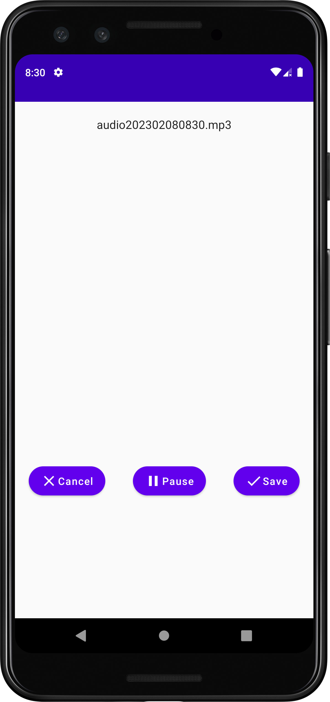

# AudioRec
Simple Audio recorder to display a list of recorded audios with play and pause capabilities.

# Screenshots

|<strong>Empty Recordings</strong>|<strong>Recording Screen</strong>|<strong>Recording Audio</strong>|<strong>Recorded Audios</strong>|
|:--:|:--:|:--:|:--:|
|||||

